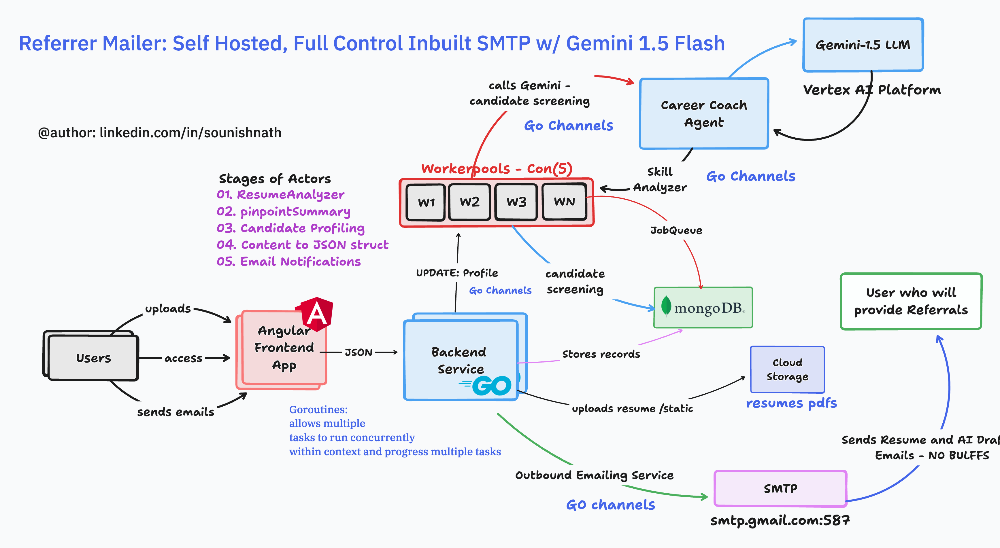
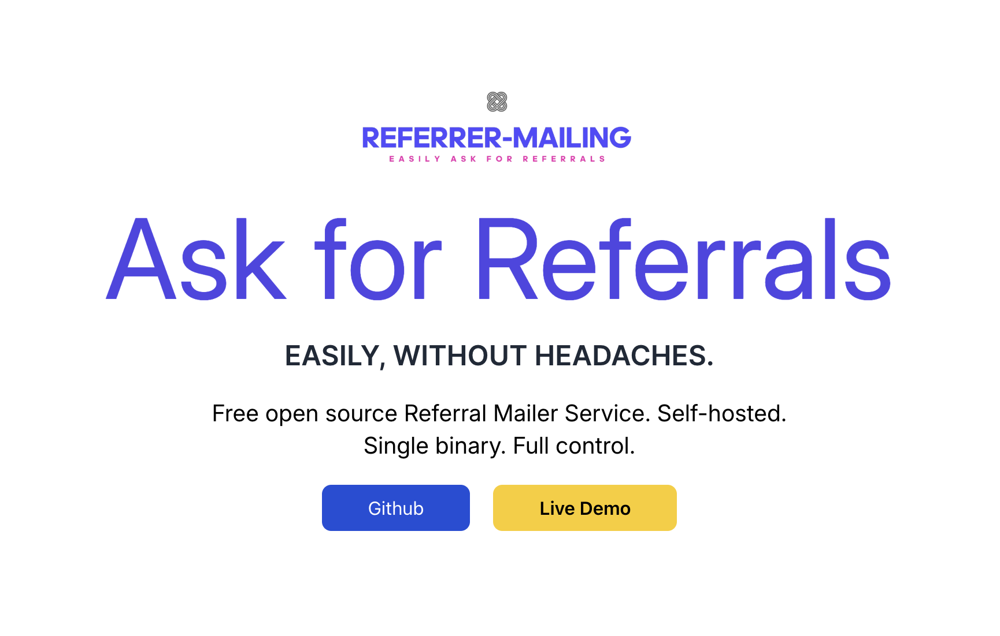
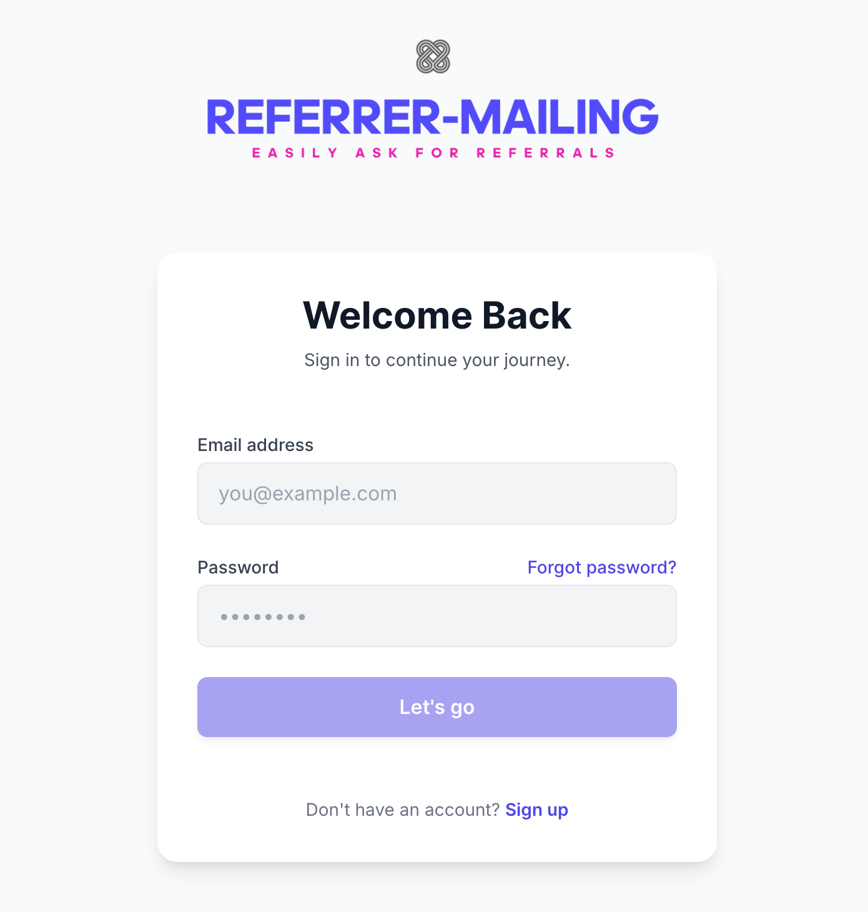
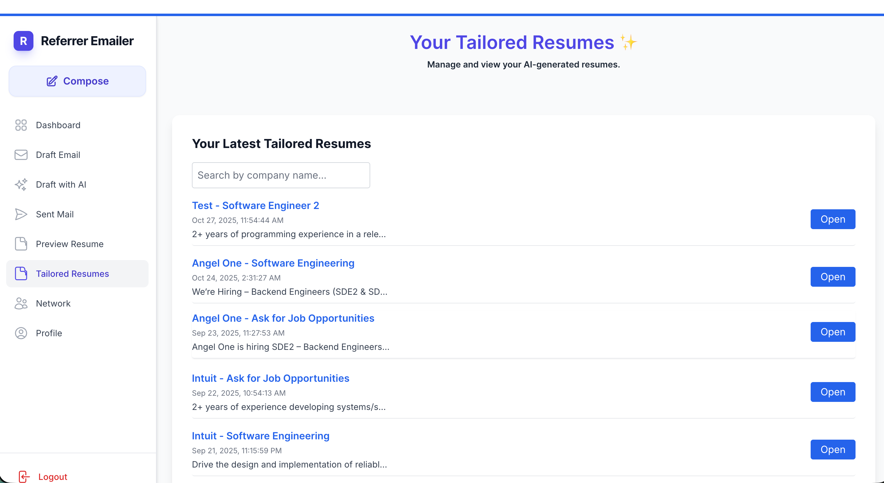
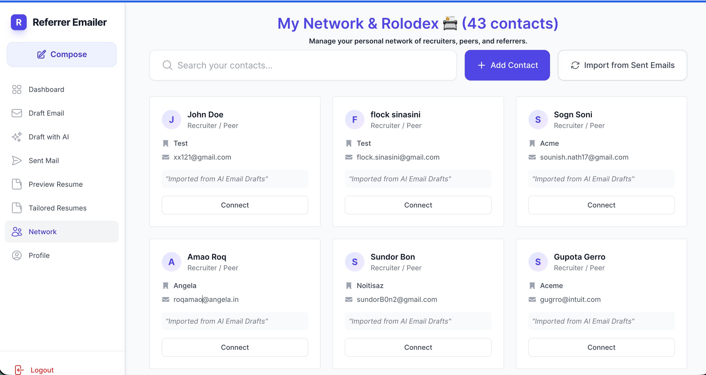
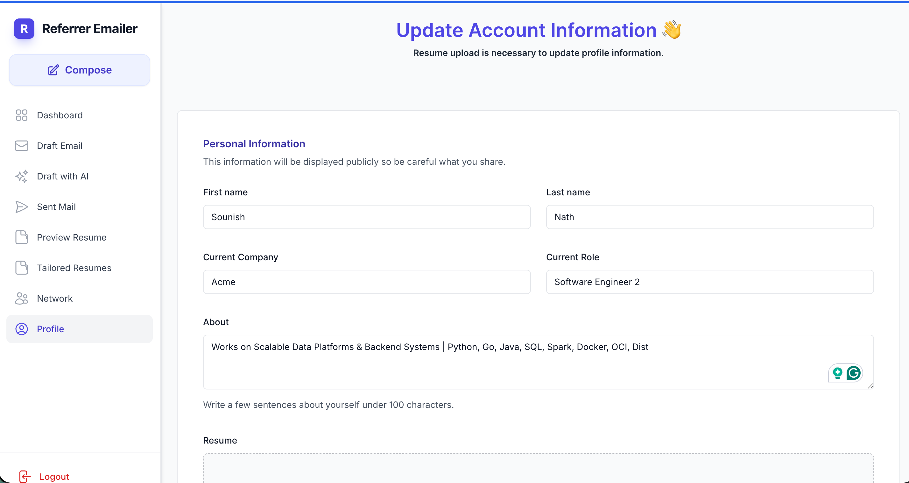
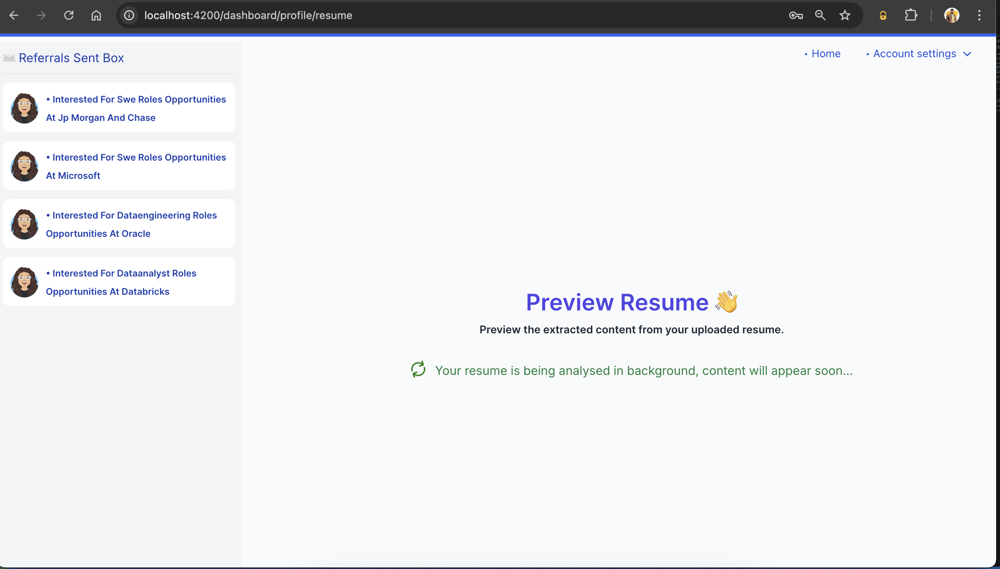
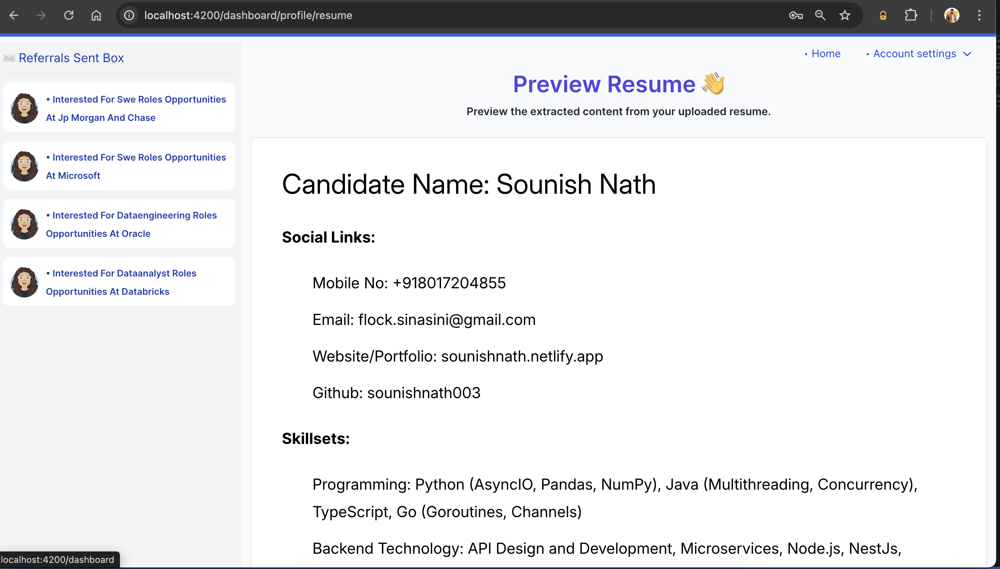

# Referrer Mailer - Self-Hosted, Full Control Referral System

[](LICENSE)
[](https://github.com/sounishnath003/referrer-emailer-go/issues)
[](https://github.com/sounishnath003/referrer-emailer-go/stargazers)

**Referrer Mailer** is a powerful, self-hosted referral system designed to give you complete control over your referral process. Leveraging the power of Gemini-2.5-flash, Go, MongoDB, and Angular, this project automates resume analysis, candidate screening, and email notifications.

## High Level Architecture:


## Landing Page



## Features

* **Self-Hosted & Full Control:** Maintain complete ownership and privacy of your data.
* **AI-Powered Candidate Screening & Summaries:** Leverage Gemini 2.5 Flash for intelligent candidate evaluation and profile summaries.
* **AI-Powered Resume Customization:** Craft tailored resumes specifically for job descriptions using AI.
* **AI-Powered Email Drafting:** Generate personalized cold emails and referral messages with AI assistance.
* **Network & Rolodex Management:**
    *   Manage your personal network of recruiters, peers, and referrers.
    *   Add and store contact details, including name, email, company, role, LinkedIn, notes, and **mobile number**.
    *   Search and filter your contacts efficiently.
    *   **Delete individual contacts.**
    *   Import contacts directly from your sent emails.
* **Automated Resume Analysis:** Extract key information from uploaded resumes.
* **Efficient Processing:** Go backend with worker pools and goroutines for concurrent task execution.
* **Scalable Database:** MongoDB for robust data storage and job queue management.
* **User-Friendly Interface:** Angular frontend for a seamless user experience.
* **Inbuilt SMTP:** Reliable email delivery with your preferred SMTP server.
* **Cloud Storage Integration:** Store resumes and other related files securely.
* **Automated Email Notifications:** Send personalized referral emails and AI-drafted emails.

## Technologies Used

* **Backend:** Go
* **Database:** MongoDB
* **Frontend:** Angular
* **AI:** Gemini 2.5 Flash (Vertex AI Platform)
* **Email:** SMTP
* **Cloud Storage:** (Specify which cloud storage you are using, e.g., Google Cloud Storage)


## Login or Signup


## Dashboard


## Tailored Resumes



## My Network



## Update Account Settings



The system follows a multi-stage workflow:

1.  **Resume Upload:** Users upload resumes through the Angular frontend.
2.  **Resume Analysis (ResumeAnalyzer):** Extracted data from the resume.
3.  **Pinpoint Summary:** A brief summary of the resume.
4.  **Candidate Profiling:** Detailed profile generation.
5.  **Content to JSON Struct:** Convert extracted data to a structured JSON format.
6.  **Email Notifications:** Send automated emails.
7.  **Candidate Screening:** Using Gemini 1.5 Flash for candidate evaluation.
8.  **Data Storage:** MongoDB stores records, and cloud storage holds resume files.
9.  **Outbound Email Service:** SMTP for sending emails.
10. **Worker Pools & Goroutines:** Efficient task processing.

## Getting Started

### Prerequisites

* Go (version 1.x)
* MongoDB
* Angular CLI
* Google Cloud Platform (GCP) Account (if using GCP services)
* SMTP Server Credentials

## Resume Analyzer & Profile Metrics (Powered by Gemini)


## Resume view (Auto Extraction)


## Mailbox / Sent Referrals


### Installation

1.  **Clone the repository:**

    ```bash
    git clone [https://github.com/sounishnath003/referrer-emailer-go.git](https://www.google.com/search?q=https://github.com/sounishnath003/referrer-emailer-go.git)
    cd referrer-emailer-go
    ```

2.  **Backend Setup (Go):**

    * Navigate to the backend directory.
    * Install dependencies: `go mod tidy`
    * Configure MongoDB and SMTP settings in the `.env` file or environment variables.
    * Run the backend: `go run main.go`

3.  **Frontend Setup (Angular):**

    * Navigate to the frontend directory.
    * Install dependencies: `npm install`
    * Configure backend API endpoints in the Angular environment files.
    * Run the frontend: `ng serve`

4.  **MongoDB Setup:**

    * Ensure MongoDB is running and accessible.
    * Create the necessary database and collections.

5.  **Google Cloud Setup (if applicable):**

    * Set up a Google Cloud Project and enable necessary APIs.
    * Configure credentials for accessing Google Cloud Storage and Vertex AI.


6. **Run the Project (Locally)**

    * Makefile 
    
```bash
    .PHONY: install
    install:
        go mod tidy
        go mod download
        go mod verify

    .PHONY: build
    build:
        CGO_ENABLED=0 GO_ARCH=amd64 go build -o ./tmp/main ./cmd/*.go

    .PHONY: run
    run: build
        ./tmp/main

    .PHONY: web
    web:
        cd web && npm start

    .PHONY: all
    all: build
        source .env && make run &
        cd web && npm start

    .PHONY: compose-up
    compose-up:
        docker-compose down
        docker-compose up --build

    .PHONY: docker-build
    docker-build:
        docker rmi -f $$(docker images referrer-emailer -qa)
        docker build -t referrer-emailer -f Dockerfile .
        docker images

    .PHONY: docker-run
    docker-run:
        docker images
        source .env;
        docker run -ti -e MAIL_ADDR=$MAIL_ADDR -e MAIL_SECRET=$MAIL_SECRET -e MONGO_DB_URI=$MONGO_DB_URI -v ./storage:/home/nonroot/storage -p 3000:3000 referrer-emailer:latest    
```

* Simply Run:

```
make install
make all
```


* **Environment Variables:** Use `.env` files or environment variables to configure database connections, SMTP settings, and API keys.
* **Configuration Files:** Customize configuration files for specific settings.

## Sample Tailored Resume

You can preview a sample tailored resume generated by the AI system below:

[](assets/sample_tailored_resume.pdf)

[Download PDF](assets/sample_tailored_resume.pdf)

> _If your Markdown viewer supports PDF embedding, you can preview it inline:_

<details>
  <summary>Preview PDF inline (if supported)</summary>

  <object data="assets/sample_tailored_resume.pdf" type="application/pdf" width="100%" height="600px">
    <p>Your browser does not support PDF preview. <a href="assets/sample_tailored_resume.pdf">Download the PDF</a> instead.</p>
  </object>

</details>


## Contributing

Contributions are welcome! Please follow these steps:

1.  Fork the repository.
2.  Create a new branch for your feature or bug fix.
3.  Make your changes and commit them.
4.  Push your changes to your fork.
5.  Submit a pull request.

## License

This project is licensed under the MIT License. See the `LICENSE` file for details.

## Author

* Sounish Nath - [linkedin.com/in/sounishnath](linkedin.com/in/sounishnath)

## Contact

For any questions or suggestions, please open an issue or contact me via LinkedIn.

## Contributing
We welcome contributions! Please fork the repository and submit a pull request.

## Contact
For any questions or support, please contact [https://www.linkedin.com/in/sounishnath/](https://www.linkedin.com/in/sounishnath).

